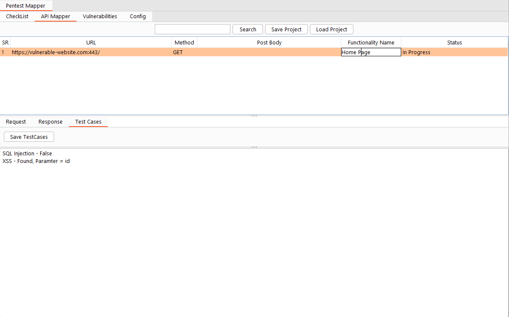
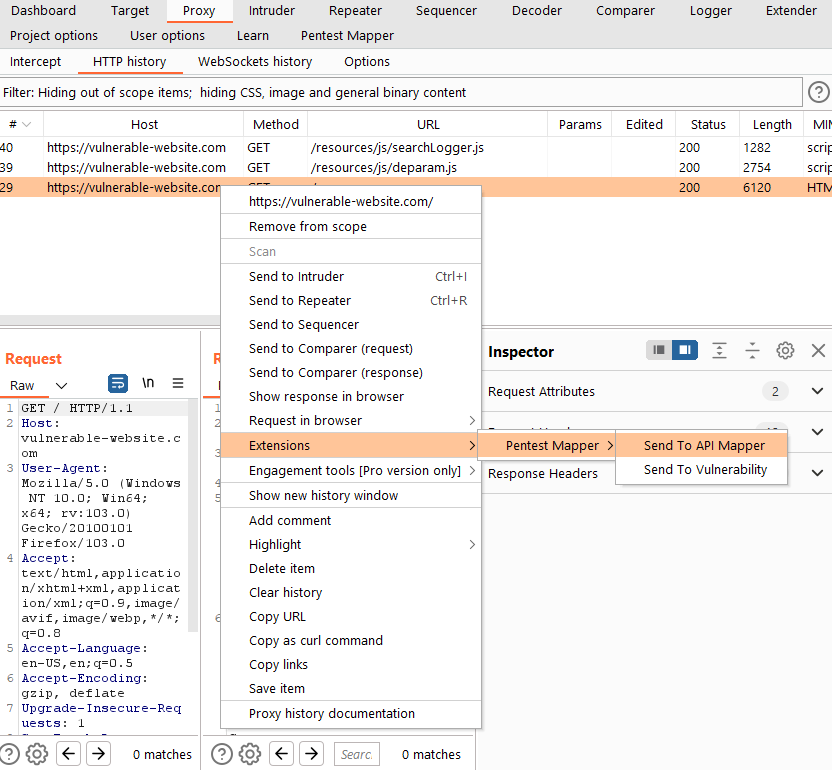

# API Mapper

The API Mapper allow users to Map the API with HTTP request and response. They can even write test cases or comments for each request.
The idea is to allow the pentester to test each API and URL at a time with test cases which he can write for each API. Also, the pentester can keep track of API like which API is completed, Pending.

## Overview

### Search

At the top of the API Mapper tab, we have a search button same as a checklist which allows us to filter the data from the table.

### Save Project

Since the BurpSuite doesn't allow extension to save the extension data within the burp suite project file. We have the option to save the API Mapper output in a CSV file.
You can click on the Save project button and select the directory and it will create a CSV file for you.

### Load Project

Once you save your API Mapper Data you also have the option to load that data again in the extension with the Load Project button.
You can click on the button, select the CSV file and it will load the data in the API Mapper

### API Mapper Table

Now we have a table with multiple columns. 
 - The 1st column `SR ` will show the row number for the table.
 - The 2nd column `URL` will show the full URL of the request.
 - The 3rd column `Method` will show the HTTP method used for that request.
 - The 4th column `Post Body` will show the Post request Body for that request.
 - The 5th column `Functionality Name` is like a text box where the user can specify the name of the Functionality the request belong. Like if this request is for login or profile etc. If you double click it will allow you to edit.
 - The 6th column `Status` will allow users to select the Pentest Status for the specific URL or API. Where he can select if the select API is completed for testing or pending etc.

### Adding Data to API Mapper Table

Since our table is empty we can add the request from BurpSuite Target, Proxy History, Repeater, Intruder etc. You can right-click on any selected request, and select extension --> Pentest Mapper --> API Mapper. Now you can view the request inside the table. 

### Test Cases

Once you click on any row in the table, You can view the request and response below the table. We also have a Test case tab where we can write the test cases for the selected API. Once we are done we can click on the save test cases button to save.

### Menu

You can select any row in the table and right-click. A menu will pop up. 
- Add to Vulnerabilities - You can send the selected requests to the Vulnerabilities tab to map the particular request to vulnerability.
- Send to Repeater - You can send the selected request to the repeater tab.
- Delete - Lastly we have the option to delete the selected row.

You can also select multiple rows to perform the actions.
