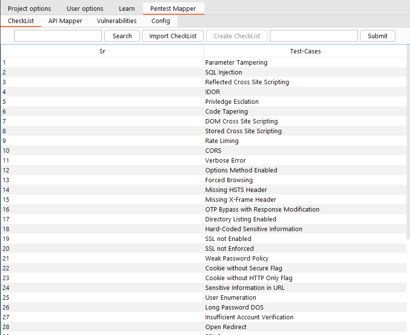

# CheckList

The extension comes with 4 different tabs inside it. The checklist tab allows users to load a custom vulnerability checklist. The checklist file will later be used while mapping the API to the vulnerabilities.
You can download the demo checklist from [here](https://github.com/Anof-cyber/Pentest-Mapper/blob/main/Checklist.CSV).



## Overview


### Search
The first thing in the checklist is the search text box and button which allows you to filter and search the vulnerabilities from the table.

### Import Checklist

You also have an import button which allows you to load your checklist CSV file into the table. This button will be removed in future updates so you can ignore this button.
To load the checklist you can go to the config tab.

### Create Checklist

You have a create button once you click on that button it will show you a text box which allows you to create a new test case or add a new vulnerability in your table.
This creates button is useful if you need to add a new vulnerability to your checklist table.

**Note:**  If you add a new vulnerability using create button, it will only add to your table but your CSV file which you have imported will not be updated.
This is only valid if you load the checklist from the import checklist button. If you load the checklist from the config tab it will update the CSV file if you create a new vulnerability with create button.

```

- It's recommended that you load the checklist from the config tab.

```

