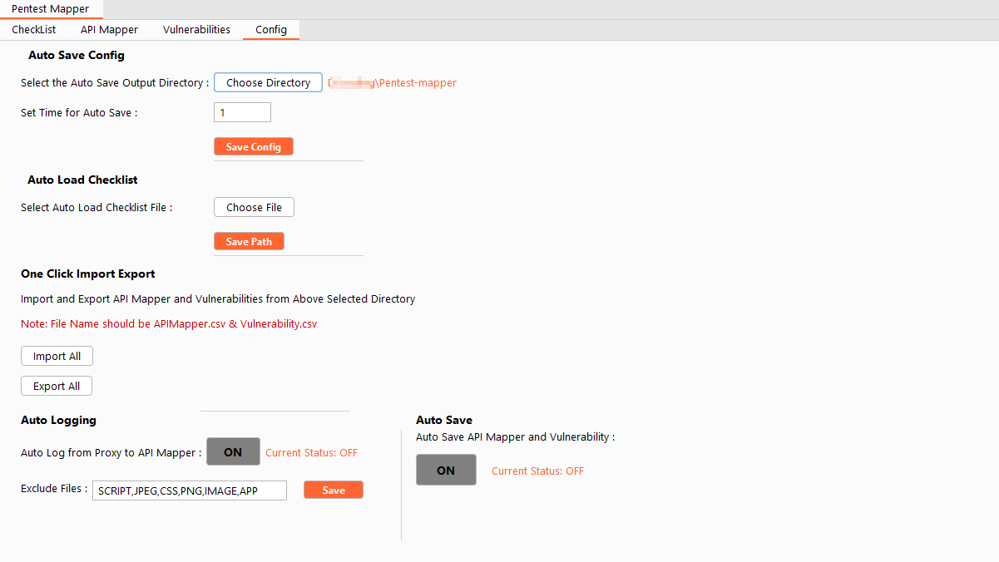

# Config

Lastly we have an Configuration tab where we can set multiple options for our extension.



## OverVIew

### Auto Save Config

The extension allows users to store API Mapper and Vulnerabilities output individually. The problem arises here when for some reason burp or system is closed without saving the output.
We have the AutoSave method. The Autosave need to be configured, you have to select the output directory and time. Once done you can click on the Save Config button.

Every time you load the extension or open the burp suite the saved setting will not be removed since ita stored in your burp configuration.

The Autosave will run after every 10 minutes ( default time ), and will create two files in the output directory as ```vulnerability.csv``` and ```APIMapper.csv```.
Each time the extension tries to save it will overwrite the files so make sure you import the data first before the auto-save start or change the directory.

### Auto Load Checklist

You can select your checklist file from here. If you load the checklist from here. The file path will be stored and each time extension is loaded the checklist will autoload.
Also once you add a new vulnerability in the checklist tab with create button. the data will also be updated in the CSV file.

### One Click Import Export

You can import or export the API Mapper and vulnerability data with a single button. The extension will try to check if the autosave directory is selected and saved and then it will look for the  ```vulnerability.csv``` and ```APIMapper.csv```files in that directory to import.
To export only the autosave directory should be saved.

### Auto Logging

The extension will add each request from the proxy to API Mapper if the Auto Logging is set to ON. it will only add the data in API Mapper if the URL is in scope from the Burp Suite Target tab.
You can also select the excluded files.  The default setting is set to OFF.

### Auto Save

By default, the Auto Save is off. You can turn on Auto Save.
