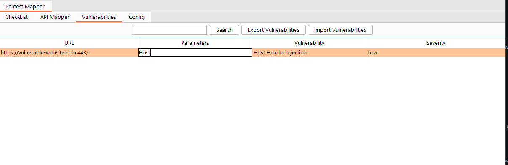

# Vulnerabilites

The Vulnerabilities tab allows you to keep track of each vulnerability found during the testing of the application. You can add the URL, Parameter, severity and name of the vulnerability.

## Overview

### Search

At the top of the Vulnerabilities tab, we have a search button same as a checklist which allows us to filter the data from the table.

### Export Vulnerabilities

Since the BurpSuite doesn't allow extension to save the extension data within the burp suite project file. We have the option to save the vulnerability output in a CSV file.
You can click on the Export Vulnerabilities button and select the directory and it will create a CSV file for you.

### Import Vulnerabilities

Once you save your Vulnerabilitesr Data you also have the option to load that data again in the extension with the Import Vulnerabilities button.
You can click on the button, select the CSV file and it will load the data in the Vulnerabilities.

### Vulnerabilities Table

Now we have a table with multiple columns. 

 - The 1st column `URL ` will show the full URL of the request.
 - The 2nd column `Parameter` will allow you to enter the vulnerable parameter name. You can double-click and edit the cell
 - The 3rd column `Vulnerability` will show a drop-down list from the checklist tab. You can select the vulnerability to which the particular API is vulnerable.
 - The 4th column `severity` will again show a drop-down list where you can select if the vulnerability is Critical, High, Medium, Low or Informational.

### Adding Data to Vulnerabilities Table

Same as API Mapper you can add the data in the Vulnerabilities table from  BurpSuite Target, Proxy History, Repeater, Intruder etc. You can right-click on any selected request, 
and select extension --> Pentest Mapper --> API Mapper. Now you can view the request inside the table. 

You can also right-click on any row in API MApper and select send to vulnerability to add the data here.
