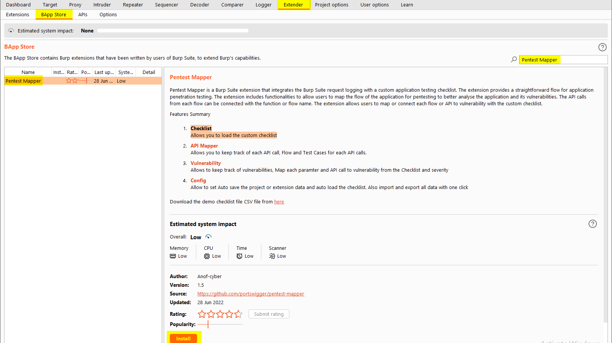
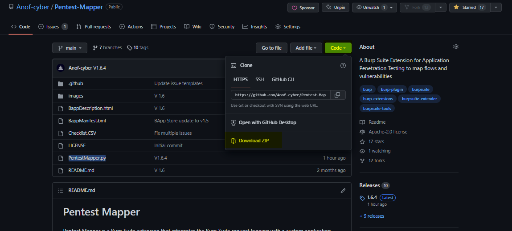

# Installation

You need to add the Jython in your burp Suite before your start installing the extension. You can use the BurpSuite guide to complete the process from [Here](https://burpsuite.guide/runtimes/python/).

## Burp Suite Extender

You can download the Pentest Mapper within the BurpSuite extender.


- GO to the Extender tab in the Burp Suite
- Click on BApp Store
- Search `Pentest Mapper` and Click on the install button

## Manual
The manual installation process is simple. You need to download the repository and load the `PentestMapper.py` file in the burp Suite.


- You can download the repository as a git clone or you can download the zip file as well.

```
git clone https://github.com/Anof-cyber/Pentest-Mapper
```




- Open your BurpSuite Click on the Extender Tab.
- Click on Add button and select python from the dropdown list
- Click on the select file button and select the `pentestmapper.py` file

